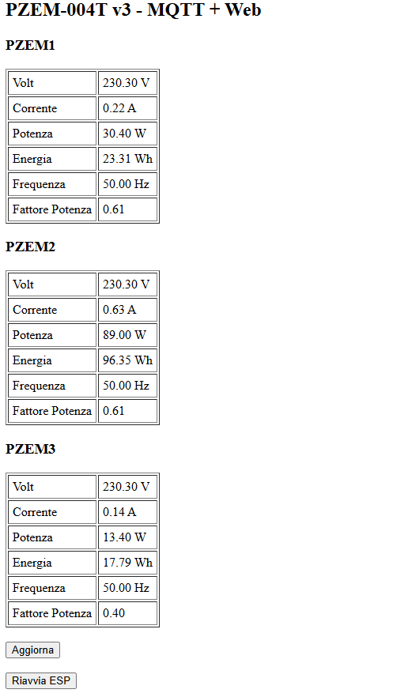

# PZEM004T v3 Monitor with ESP8266, MQTT and Home Assistant

This project enables monitoring up to 4 **PZEM-004T v3** modules using an **ESP8266**, publishing data to **MQTT**, and automatically integrating with **Home Assistant** using **AutoDiscovery**. It also includes a **web debug interface**, **OTA support**, and automatic network fault recovery.

---

## 📦 Features

- 🔌 Reads data from 4 PZEM-004T v3 modules via **SoftwareSerial** (D5/D6)
- 📶 WiFi connection with **automatic retry and reboot** after 5 failed attempts
- 📡 MQTT connection with **512 byte buffer** and reboot on failure
- 🏠 Full **Home Assistant AutoDiscovery** support via MQTT
- 🔄 Publishes data as **retained**, so HA reads values immediately after restart
- 🌐 Web interface with live readings and a **remote ESP reboot button**
- 🔧 Supports **OTA updates** over the network

---

## ⚙️ Required Hardware

- 1x ESP8266 (NodeMCU or Wemos D1 Mini recommended)
- 4x PZEM-004T v3 modules
- 5V Power Supply
- TX line from PZEM to ESP RX must be adapted using a **resistor divider**

---

## 📡 MQTT & Home Assistant

Each sensor (e.g. `pzem1`) publishes topics:

- `homeassistant/pzem1/voltage`
- `homeassistant/pzem1/current`
- `homeassistant/pzem1/power`
- `homeassistant/pzem1/energy` *(in kWh, `total_increasing`)*

Home Assistant discovers them using MQTT AutoDiscovery with:

- `device_class`, `unit_of_measurement`, `state_class`

The `energy` value can be used directly in the **Energy Dashboard**.

---

## 🔐 Security

MQTT authentication is supported via username and password. WiFi and MQTT credentials are configurable at the top of the `.ino` file.

---

## 🌐 Web Interface

Accessing the ESP's IP in a browser shows:

- Live readings of **voltage, current, power, energy, frequency, power factor**
- Button to **remotely reboot the ESP**

---

## 🧠 Resilience

- If WiFi fails to connect after 5 tries → **device reboots**
- If MQTT fails after 5 attempts → **device reboots**
- If Serial fail  → **device reboots**

## 📸 Screenshots

---

## ✅ Author

Massimo Balestrieri  
Feel free to fork or open pull requests! 🛠️
